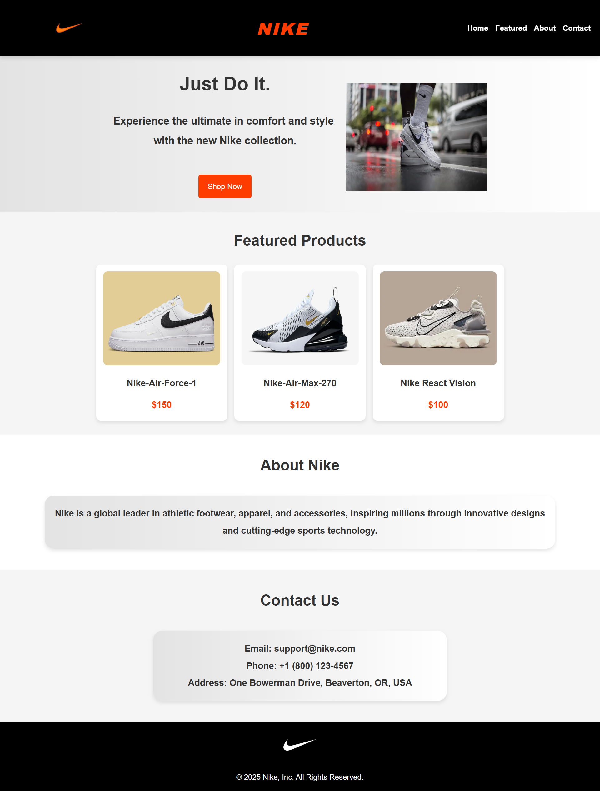

# Nike Clone (HTML & CSS)

A **Nike-inspired landing page** built with **HTML & CSS**, featuring a "Shop Now" page and an integrated **Python WebP image converter** for optimized image performance.

## 📌 Features
- **Responsive Nike-style landing page** (HTML & CSS)
- **"Shop Now" page** linked from the landing page
- **Optimized images** with WebP conversion using Python
- **Automated image processing with format detection**
- **Checks for existing WebP images before conversion**
- **Handles multiple image formats including JPG, PNG, AVIF, RAW, and more**
- **User-friendly error handling** to guide through missing folders or incorrect paths

## 📂 Project Structure
```
nike-clone-html-css/
│── assets/
│   ├── css/
│   │   ├── styles.css  # Main CSS file for landing page
│   │   ├── shop.css    # CSS file for "Shop Now" page
│   ├── images/
│   │   ├── original images/  # Uncompressed images
│   │   ├── webp images/      # WebP optimized images
├── screenshots/   
│   │   ├── landing-page.png  # added in readme 
│   │   ├── shop-page.png     # added in readme
│── index.html     # Main landing page
│── shop.html      # "Shop Now" page
│── image_to_webp.py  # Python script for WebP conversion
│── favicon-32x32.png  # Favicon
```

## 🚀 Getting Started
### 1️⃣ Clone the Repository
```bash
git clone https://github.com/huzaifa-2005/nike-clone-html-css.git
```
### 2️⃣ Open in Browser
- Open `index.html` in your browser to view the landing page.
- Click the **"Shop Now"** button to navigate to `shop.html`.

### 3️⃣ Convert Images to WebP (Optional)
#### 📌 Prerequisites
Ensure you have the required Python libraries installed:
```bash
pip install pillow-avif-plugin
```
#### 🛠️ Run the WebP Conversion Script
```bash
python image_to_webp.py
```
- Detects images in `original images/` and converts them to WebP format.
- Moves existing WebP images to the correct folder.
- Skips already converted files.

## 📸 Screenshots
### 🔹Landing Page Preview  


### 🔹Shop Now Page  


## 🌟 Technologies Used
- **HTML5**
- **CSS3** (Flexbox, Grid, Responsive Design)
- **Python** (for WebP image conversion)
---

## ⭐ Support
If you found this project useful, consider **starring** ⭐ it to show your support!  


